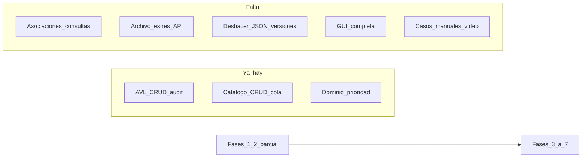

# Workplan SismoLab AVL — roles y tareas

## Contexto

- Enunciado: [docs/Proyecto Estructuras de Datos SismoLab AVL.pdf](Proyecto%20Estructuras%20de%20Datos%20SismoLab%20AVL.pdf)
- Referencia operativa: [docs/GUIA_IMPLEMENTACION.md](GUIA_IMPLEMENTACION.md)
- Base local ya clonada: núcleo dominio + AVL + catálogo CRUD + cola de reportes parcial; faltan asociaciones, archivo de rama, deshacer real, JSON dual, consultas, GUI completa y cierre.
- Entrega: **7 de octubre**. Evaluación 50% funcionalidad grupal / 50% sustentación individual.

## Recomendación de roles

Criterio: Juan Jose tiene **más tiempo y ganas de aprender estructuras**; Samuel y Jefferson tienen **más conocimiento y menos tiempo** → ellos llevan piezas de alto riesgo/diseño denso; Juan Jose lleva el **núcleo de árboles** con profundidad y pruebas, y participa en todas las decisiones.

| Persona                       | Rol principal                                                                                                                                                         | Por qué                                                                                                               |
| ----------------------------- | --------------------------------------------------------------------------------------------------------------------------------------------------------------------- | --------------------------------------------------------------------------------------------------------------------- |
| **Juan Jose**                 | **Estructuras + aprendizaje tutorizado** (AVL/BST, rotaciones, estrés, archivo de rama, auditoría estructural, métricas LL/RR/LR/RL, tests de §16 rotaciones/archivo) | Más horas para practicar; es lo que más pesa en la sustentación individual (claves, rotaciones, efectos en el árbol). |
| **Samuel**                    | **Lógica de dominio densa** (asociaciones W/R, política de réplica, consultas §11, parámetros Escenario W/R/L/T, huecos de catálogo/cola)                             | Reglas complejas y fáciles de romper; conviene cerrarlas rápido con buen criterio.                                    |
| **Jefferson**                 | **Persistencia + GUI** (instantáneas/deshacer, JSON carga inserciones/topología, versiones nombradas, vistas Tk árbol/mapa/formularios)                               | Mucho volumen de I/O y UI; se beneficia de experiencia previa y menos “reinventar” el dominio.                        |
| **Los tres + tutor (Cursor)** | **Contrato y decisiones abiertas** (política réplica, esquema JSON, deshacer por instantánea profunda, índice de asociaciones)                                        | Juan Jose propone; Samuel/Jefferson critican; el tutor evalúa contra el PDF antes de codificar.                       |

**Modelo de tutoría (Juan Jose + Cursor):**

1. Antes de implementar una tarea de estructuras: Juan Jose escribe en 5–10 líneas la decisión (qué, por qué, costo).
2. Tutor valida contra PDF/guía (aceptar / ajustar / rechazar con motivo).
3. Luego se implementa; cada PR/cambio trae prueba + comentario en inglés si la regla no es obvia.
4. Samuel/Jefferson revisan integración (catálogo/GUI) cuando toque su frontera.

**No negociable (ya cerrado por el PDF):** clave `(P,M,I)`, prioridad, pila/cola propias, AVL central (no lista ordenada), JSON sin ruta fija, GUI separada de negocio, sin libs de árboles/pilas/colas/colecciones ordenadas.

**Decisión conjunta #1 (cerrar en la primera sesión de equipo):** política de réplica determinista. Propuesta guía: mayor magnitud → ocurrencia más cercana anterior → ID menor. Samuel documenta; Juan Jose y Jefferson aprueban; tutor valida.

## Estado actual (resumen)

Huecos críticos del código actual: BST no se sincroniza en corrección/eliminación; `modo_estres` no se activa; historial es stub (`AccionPendienteDeInstantanea`); sin archivo de rama, asociaciones, JSON, ni GUI real.

## Tabla de tareas (responsable único; el resto revisa en frontera)

### A. Contrato y base (todos; Juan Jose coordina)

| ID  | Tarea                                                  | Responsable                              | Criterio hecho                          |
| --- | ------------------------------------------------------ | ---------------------------------------- | --------------------------------------- |
| A1  | Revisar PDF + guía; checklist de entrega §17           | Juan Jose                                | Lista compartida de entregables y fecha |
| A2  | Cerrar política de réplica + documentarla              | Samuel (doc) + aprobación equipo         | Texto en guía/manual técnico            |
| A3  | Definir esquema JSON (eventos vs topología)            | Jefferson (borrador) + aprobación equipo | Esquema + mensajes de error             |
| A4  | Acordar política de deshacer (instantánea profunda v1) | Juan Jose propone; equipo aprueba        | Decisión escrita; tutor OK              |

### B. Estructuras (Juan Jose lead; Samuel review puntual)

| ID  | Tarea                                                                          | Responsable        | Criterio hecho                                                     |
| --- | ------------------------------------------------------------------------------ | ------------------ | ------------------------------------------------------------------ |
| B1  | Activar/desactivar modo estrés en catálogo; inserciones/elim sin giros         | Juan Jose          | API clara; UI podrá indicar modo                                   |
| B2  | Sincronizar BST en crear/corregir/eliminar (misma secuencia de claves)         | Juan Jose          | Mismas búsquedas comparables AVL vs BST                            |
| B3  | Completar recuperación estrés (pausar cola, pasadas hasta auditoría OK)        | Juan Jose          | FB fuera de rango solo en estrés; orden intacto                    |
| B4  | Archivar rama (§10): elegibilidad, desempates, conjunto fijo, histórico        | Juan Jose          | Casos: elegible, empate, inválida por descendiente, árbol completo |
| B5  | Tests estructurales: LL/RR/LR/RL, FB>2, archivo, auditoría global              | Juan Jose          | Cubren §16 rotaciones + archivo                                    |
| B6  | Indicadores estructurales (contadores giros, alturas, hojas, acceso costoso L) | Juan Jose (núcleo) | Contadores restaurables con estado                                 |

### C. Lógica / catálogo (Samuel lead; Juan Jose en fronteras AVL)

| ID  | Tarea                                                                                       | Responsable             | Criterio hecho                                        |
| --- | ------------------------------------------------------------------------------------------- | ----------------------- | ----------------------------------------------------- |
| C1  | `Escenario`: estaciones inmutables, W/R/L/T, reloj, métricas                                | Samuel                  | Parámetros mutables con acción deshacible             |
| C2  | Asociaciones §7: candidatos, sin ciclos, update en alta/corrección/elim/W/R                 | Samuel                  | Política A2 aplicada; rotación no cambia asociaciones |
| C3  | Consultas §11: top-k pendientes, magnitud/fechas/H, refs, acceso costoso + nodos examinados | Samuel                  | Cada consulta reporta nodos visitados                 |
| C4  | Huecos catálogo: guardar cuerpo eliminado; reactivación archivado; marca acceso costoso     | Samuel                  | Cumple §6 y §9                                        |
| C5  | Cola: ráfaga N reportes, paso a paso / continuo; feedback de decisión                       | Samuel (+ Jefferson UI) | Demuestra altas/confirmaciones/antiguos/correcciones  |
| C6  | Tests de dominio: límites prioridad, corrección+reporte antiguo, reporte tardío §16         | Samuel                  | Casos mínimos 1–3 verdes                              |

### D. Persistencia y deshacer (Jefferson lead)

| ID  | Tarea                                                            | Responsable | Criterio hecho                                                |
| --- | ---------------------------------------------------------------- | ----------- | ------------------------------------------------------------- |
| D1  | Instantánea profunda pre-acción + `deshacer()` vía pila propia   | Jefferson   | Deshace corrección, archivo, paso de cola (incluido descarte) |
| D2  | Export JSON estructural completo (§12 guardado)                  | Jefferson   | Recupera topología + cola + params + métricas                 |
| D3  | Carga por inserciones (AVL+BST) con explorador de archivos       | Jefferson   | Duplicado ID invalida; muestra métricas ambos árboles         |
| D4  | Carga por topología + validaciones; estrés solo si desbalanceada | Jefferson   | Rechazo no muta escenario actual                              |
| D5  | Versiones nombradas persistentes + restaurar (acción deshacible) | Jefferson   | Sobrevive reinicio                                            |
| D6  | Tests persistencia §16 caso 6                                    | Jefferson   | Normal, estrés, JSON inválido, versión, undo cola             |

### E. Interfaz (Jefferson lead UI; Juan Jose apoyo formularios/indicadores)

| ID  | Tarea                                                        | Responsable                                 | Criterio hecho                                           |
| --- | ------------------------------------------------------------ | ------------------------------------------- | -------------------------------------------------------- |
| E1  | Shell: formularios crear/consultar/corregir/revisar/eliminar | Juan Jose (más tiempo en pantallas simples) | Operaciones llaman solo servicios de catálogo            |
| E2  | Vista gráfica AVL + vista comparativa BST                    | Jefferson                                   | Inspección claves/enlaces tras operaciones               |
| E3  | Mapa geográfico 0–1000 + eventos                             | Jefferson                                   | Interpretable; prioridad vs acceso costoso distinguibles |
| E4  | Paneles: cola, histórico, auditoría, versiones, indicadores  | Jefferson + Juan Jose                       | Verificar estructura usable en ambos modos               |
| E5  | Separación estricta GUI / negocio                            | Ambos en review                             | Sin mutar nodos AVL desde la GUI                         |

### F. Cierre y sustentación (todos)

| ID  | Tarea                                                         | Responsable                                                                   | Criterio hecho                                                               |
| --- | ------------------------------------------------------------- | ----------------------------------------------------------------------------- | ---------------------------------------------------------------------------- |
| F1  | Fixtures JSON + ráfagas reproducibles                         | Jefferson (archivos) + Samuel (escenarios lógicos)                            | Cubren §16                                                                   |
| F2  | Manual de usuario                                             | Juan Jose (borrador; más tiempo)                                              | Cómo operar la app                                                           |
| F3  | Manual técnico: dominio, JSON, invariantes, costos, uso de IA | Samuel (costos/asociaciones) + Juan Jose (AVL/estrés) + Jefferson (JSON/undo) | Adjunta por correo; no solo en Git                                           |
| F4  | README ejecución + comentarios en inglés                      | Juan Jose                                                                     | `python main.py` / tests claros                                              |
| F5  | Video arquitectura (2º idioma) + videotutorial                | Los tres (aparición visible)                                                  | Participación equilibrada                                                    |
| F6  | Commits evidentes por integrante en Git                       | Cada uno en su área                                                           | Historial atribuible                                                         |
| F7  | Ensayo de sustentación individual                             | Cada uno                                                                      | Juan Jose prioriza: comparación de claves + rotación + efecto en estructuras |

## Orden de trabajo sugerido (hasta el 7 oct)

1. **Semana 1 (ahora):** A1–A4 + B1–B2 + C1 + D1 arranque (contrato + estrés API + Escenario + undo mínimo).
2. **Semana 2:** B3–B5 + C2–C4 + D2–D4 (archivo, asociaciones, JSON).
3. **Semana 3:** C5–C6 + E1–E4 + D5–D6 (consultas, GUI, versiones).
4. **Últimos días:** F1–F7 (casos demo, manuales, videos, ensayo).

Regla de la guía: **no avanzar de fase sin pruebas de la anterior**.

## Cómo trabajaremos con el tutor

- Juan Jose toma B* y partes de A/E/F; propone decisiones antes de codear.
- El tutor evalúa cada decisión: alineación PDF, costo, riesgo de inconsistencia, si rompe invariantes.
- Samuel/Jefferson no son “bloqueadores”: si no responden, Juan Jose avanza con decisión documentada y se revalida juntos.
- Este plan es el tablero; al ejecutar, se puede bajar a issues/checklist en el repo.
